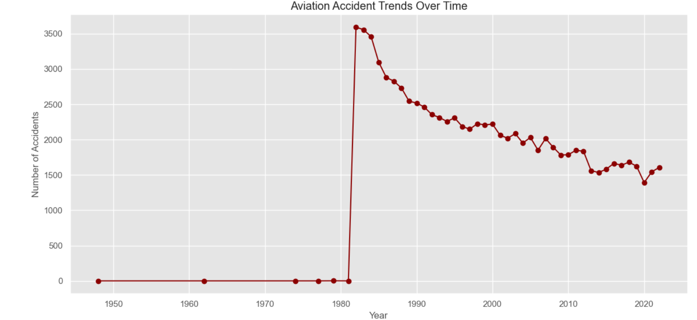
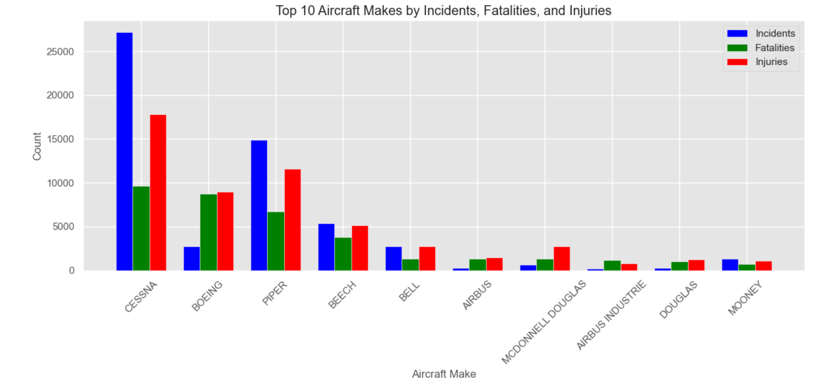
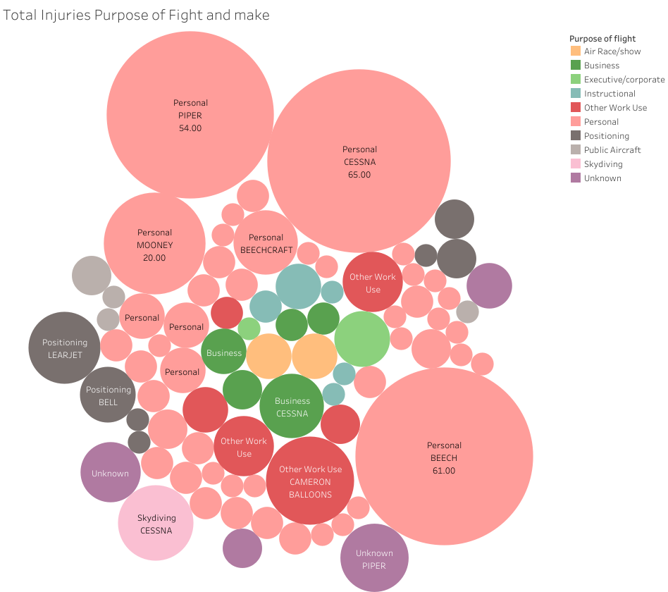
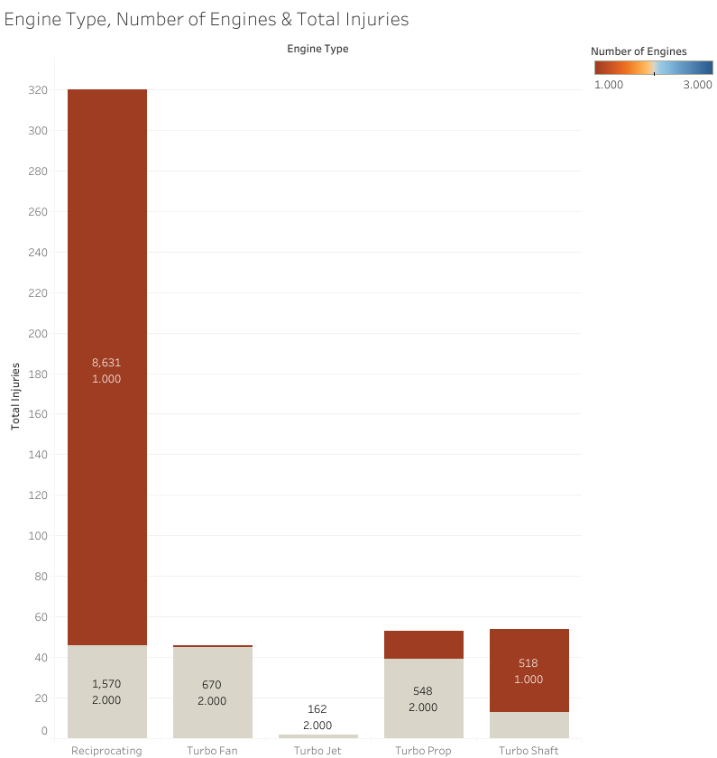
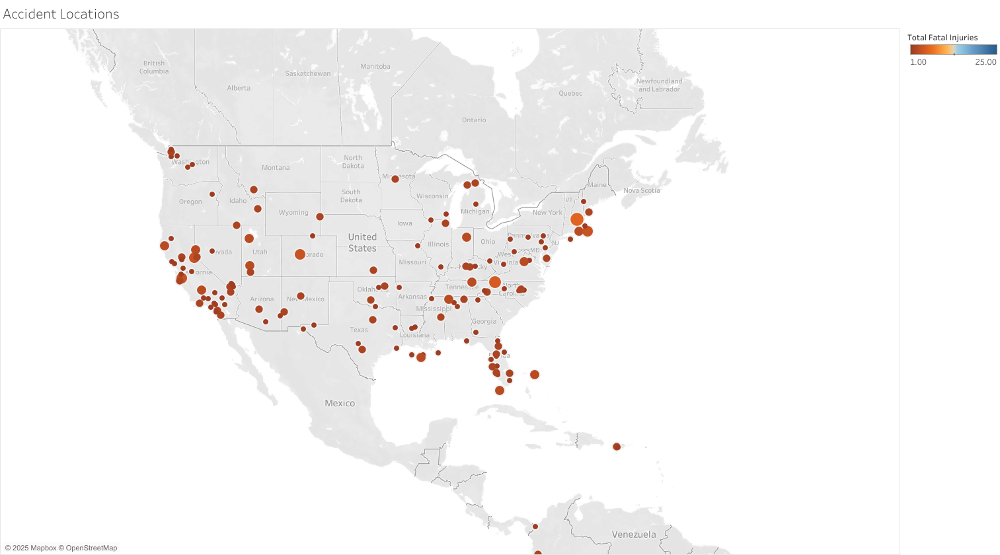
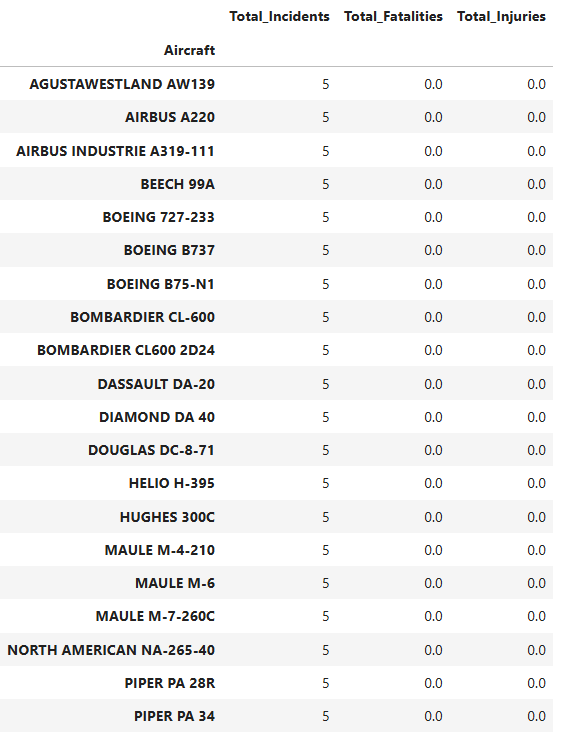

**Phase 1 Project**

**Overview**

This project explores over 90,000 aviation incidents to uncover hidden trends and high-risk patterns across flight operations,

aiming to identify the safest aircraft makes for business investment.

Using Python for data wrangling and Tableau for visual storytelling, we analyze key variables such as event dates, locations, aircraft makes, engine types.

**Business Understanding**

The company is expanding its investment portfolio by entering the aviation industry. 

As part of this strategic move, the company requires a data-driven assessment of historical aircraft incidents and accidents to evaluate operational risks.

This project leverages aviation data from the National Transportation Safety Board (NTSB) to uncover trends in aircraft make, 

flight purpose, injury severity, and incident frequency. 

The objective is to identify lower-risk aircraft types and flight operations to support safer and more informed business decisions.

**Stakeholders**

* Company executives evaluating investment opportunities
* 
* A newly formed aviation division seeking operational safety guidance
* 
* Risk and compliance teams supporting due diligence

**Key Business Questions**

* Which aircraft models have historically been involved in the fewest injuries or fatalities?
* 
* Are certain types of flight operations (e.g., personal, business, commercial) riskier than others?
* 
* How do risks vary by aircraft engine type or manufacturer?
* 
* What are the most common causes or patterns behind high-injury incidents?
* 
* Which trends can help us minimize operational risk in future aircraft acquisitions?
* 
* The goal is to translate these questions into actionable insights using historical accident data and guide data-informed aircraft selection.

**Data Understanding**

**Source of Data**

The dataset used in this project comes from the National Transportation Safety Board (NTSB).

&nbsp; It contains detailed records of aircraft accidents and incidents, including injury counts, aircraft characteristics, and purpose of flight.

 **Description of Data**

The dataset includes over 90,000 aviation incident records with the following key fields:

•	Event ID, Date, Location (Latitude \& Longitude)

•	Aircraft Make \& Model

•	Engine Type

•	Purpose of Flight (e.g., Personal, Business, Instructional)

•	Number of Fatal and Non-Fatal Injuries

After cleaning and preprocessing, null values were handled, and irrelevant entries were  removed. 

The refined dataset enabled meaningful analysis of risk across various aircraft attributes and flight purposes.

**Data Analysis**

**Aviation Accident Trends Over Time**

We observe a sharp spike in incidents around 1982, which likely corresponds to improvements in reporting practices rather than an actual surge in accidents. 
Since that time, the number of aviation accidents has steadily declined, likely due to several contributing factors:

* Stricter regulations and oversight

* Improved industry compliance

* Significant technological advancements in aircraft safety systems

While modern aviation is significantly safer today, sustaining this safety record requires continued investment in:

* Advanced equipment

* Ongoing pilot and crew training

* A strong safety culture.

**Top 10 Aircraft Makes with Highest Injuries**

Cessna leads in all three categories—incidents, injuries, and fatalities—followed by Piper and Boeing. 
This suggests that while these aircraft make are widely used, they may also carry higher operational risks based on their historical incident records.

**Total Injuries, Purpose of Flight, and Make**

Personal flights account for the highest number of injuries, with Cessna, Piper, and Beech aircraft most frequently involved. 
Significant injury counts are also observed in categories such as "Other Work Use" and skydiving operations. In contrast, 
Business and executive flights report relatively lower injury rates, suggesting safer outcomes in more structured or regulated flight purposes.

**Number of Accidents by Engine Types**

* Reciprocating (1 engine): 8,631 injuries – highest risk, especially in single-engine aircraft.

* Reciprocating (2 engines): 1,570 injuries – still risky, but significantly safer than single-engine counterparts.

* Turbo Fan & Turbo Jet (2 engines): 670 and 162 injuries, respectively – lower injury counts, suggesting higher safety in commercial jet operations.

* Turbo Prop (2 engines): 548 injuries – moderate risk in twin-engine propeller aircraft.

* Turbo Shaft (1 engine): 518 injuries – primarily helicopters, with a moderate injury count.

**Geographical Accident Distribution**

Most fatal aviation accidents are concentrated within the United States, highlighting it as a primary region of concern in terms of incident frequency and severity.
This trend can be attributed to the country’s high volume of air traffic, widespread use of private aircraft, and comprehensive reporting systems.
On the map, larger circles represent higher fatality counts—some reaching up to 25 lives lost in a single incident. The spatial distribution reveals several high-density zones across the U.S.,
whereas other regions around the world appear with fewer incidents, likely due to a combination of lower aviation activity, underreporting, or limited access to detailed records.
These geographic insights emphasize the importance of focusing safety improvements and investment strategies in regions with historically higher incident rates.

**Top 10 Aircraft With Few Incidents**

These aircraft models experienced incidents without resulting in serious consequences, indicating the presence of effective safety features, 
well-trained crew response, or favorable operating conditions. This highlights an important distinction: not all incidents lead to injuries or 
fatalities, especially when strong aviation safety systems are in place.

